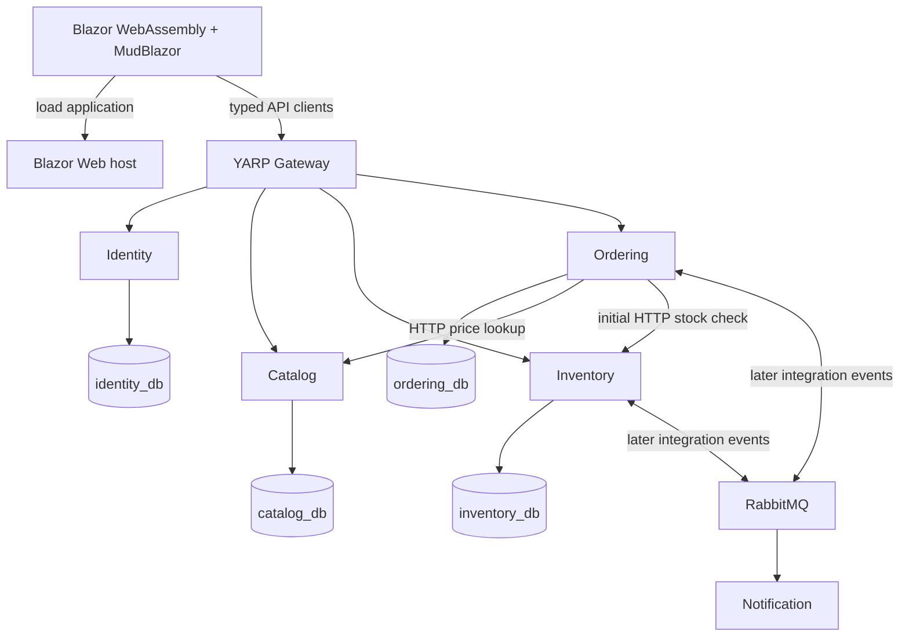

# MicroShop

A step-by-step .NET 10 microservices learning project. This repository currently contains the
Phases 0–4: planning, skeleton, infrastructure, Catalog and Inventory.
Catalog provides product/category CRUD. Inventory provides stock records, safe concurrent adjustments
and availability reads. Both use EF writes, Dapper reads, explicit migrations and development seeds.

Start with [the implementation plan](docs/IMPLEMENTATION_PLAN.md),
[current status](docs/CURRENT_STATUS.md) and [next steps](docs/NEXT_STEPS.md).
AI agents must read [AGENTS.md](AGENTS.md) and follow its documentation reading order.

## Target architecture



Each service owns its data. EF Core handles commands and Dapper handles read projections.
HTTP and integration events cross service boundaries; SQL queries and domain entities do not.
See [architecture](docs/ARCHITECTURE.md) for dependency, authentication and order-flow diagrams.

## Build and run

Prerequisites: .NET SDK 10.0.302 (or a later patch in that feature band), Git, and a modern browser.
Catalog and Inventory require Docker with a running Linux engine and Compose v2 for PostgreSQL.
Other hosts are still skeletons. First prepare the infrastructure below, then follow
[Catalog](docs/catalog.md) and [Inventory](docs/inventory.md) guides to apply each migration and seed.

From this directory:

```powershell
dotnet restore MicroShop.sln
dotnet build MicroShop.sln --no-restore
./scripts/Test-All.ps1
```

Verified Phase 4 result: build had **0 warnings/errors** and **71 tests passed** (4 architecture,
23 unit/application, 44 real PostgreSQL integration). Tests require local `.env` and running PostgreSQL.
Test-All prepares separate service connections; Test-Catalog remains a compatibility wrapper for the suite.
On Windows with PowerShell 7.3+, run `./scripts/Test-Skeleton.ps1` after building/applying both migrations.
It checks seven hosts, including Catalog/Inventory database reads and Swagger, and stops hosts afterward.
It verifies HTTP/bootstrap delivery without automating a browser.

Open MicroShop.sln in an IDE with .NET 10 support, or run any host independently in a terminal:

```powershell
dotnet run --project src/Web/MicroShop.Web --launch-profile http
dotnet run --project src/Gateway/MicroShop.Gateway --launch-profile http
dotnet run --project src/Services/Identity/Identity.Api --launch-profile http
# Set in Catalog's terminal before launching it:
./scripts/Set-ServiceEnvironment.ps1 -Service Catalog
dotnet run --project src/Services/Catalog/Catalog.Api --launch-profile http
# Set in Inventory's separate terminal before launching it:
./scripts/Set-ServiceEnvironment.ps1 -Service Inventory
dotnet run --project src/Services/Inventory/Inventory.Api --launch-profile http
dotnet run --project src/Services/Ordering/Ordering.Api --launch-profile http
dotnet run --project src/Services/Notification/Notification.Service --launch-profile http
```

Use separate terminals for simultaneous hosts; set only each service's own environment in its terminal.
Start PostgreSQL and apply each service's migration before accessing its data.
The Client project is served by the Web host; do not launch it separately.

| Host | URL | Available now |
|---|---|---|
| Web | http://localhost:5100 | Skeleton page in Interactive WebAssembly |
| Gateway | http://localhost:5200 | Host identification JSON; no service routes yet |
| Identity | http://localhost:5210 | Host identification JSON; OpenAPI JSON |
| Catalog | http://localhost:5220 | Product/category CRUD; OpenAPI JSON; `/swagger` |
| Inventory | http://localhost:5230 | Stock creation/adjustments/reads; OpenAPI JSON; `/swagger` |
| Ordering | http://localhost:5240 | Host identification JSON; OpenAPI JSON |
| Notification | http://localhost:5250 | Host identification JSON; no consumer yet |

In Development, each of the four APIs serves `/openapi/v1.json`.
Catalog and Inventory additionally serve Swagger UI at `/swagger`; other APIs have JSON documents only.
Gateway `/api/*` routes start in Phase 7. Health checks start in Phase 15; `/` is not a readiness check.

## Development infrastructure

Only PostgreSQL and RabbitMQ run in Docker; application hosts still run through the CLI/IDE.
The [Docker runbook](docs/docker.md) covers credentials, database isolation, lifecycle and reset.

```powershell
# First setup only; refuses to overwrite an existing .env:
./scripts/New-DevelopmentEnvironment.ps1
docker compose config --quiet
docker compose up -d --wait --wait-timeout 120
./scripts/Test-Infrastructure.ps1
```

On this machine .env already exists, with PostgreSQL host port **5433** because native PostgreSQL uses 5432.
Repository defaults remain PostgreSQL 5432, RabbitMQ 5672 and management 15672; all bind only to localhost.
Open [RabbitMQ Management](http://localhost:15672) and use credentials from ignored .env.
Four databases each have their own restricted login; all 12 cross-service connections were verified denied.
Both named volumes survived container recreation; a fresh-volume reset was also verified.

Use `docker compose down` to stop while retaining data. `docker compose down -v` deliberately deletes it.
Catalog and Inventory migrations create tables in their own databases. Identity/Ordering remain empty; no event code yet.

## Projects and references

There are 23 source projects and five test projects (architecture plus Catalog/Inventory unit and integration).
Each of Identity, Catalog, Inventory and Ordering has Api, Application, Domain and Infrastructure projects.
Api references Application and Infrastructure; Application references Domain;
Infrastructure references Application and Domain. No cross-service project references.
Web references Web.Client. Gateway, Notification and the three BuildingBlocks start without project references.
Architecture tests inspect the project graph without referencing service assemblies.

Catalog and Inventory implement their four layers. Other service libraries and BuildingBlocks contain no placeholder classes;
their use cases and persistence arrive in later phases.
See [BuildingBlocks boundaries](src/BuildingBlocks/README.md) and
[the project/package map](docs/IMPLEMENTATION_PLAN.md).
The [Phase 1 inventory](docs/PROJECT_STRUCTURE.md) lists every created file and project reference.

## Learning sequence

Plan and skeleton → development infrastructure → Catalog → Inventory → Ordering → synchronous HTTP →
Gateway routing → Blazor/MudBlazor → Identity/security → RabbitMQ basics → async reservations →
notifications → Outbox → Inbox → observability → full Docker stack → consolidated tests → final docs.

The synchronous lesson only checks availability; it does not guarantee stock reservation.
The async lesson makes reservations explicit, then introduces delivery guarantees gradually.
Early unauthenticated stages are localhost learning exercises. No production deployment is promised.

Every completed phase documents what was implemented, why, the request/data flow and the concept demonstrated.
The [decision log](docs/DECISIONS.md) records trade-offs; [phase records](docs/phases/) preserve history.

## Environment notes

Initial inspection found a Windows workload-metadata exception from `dotnet --info`, while version/templates work.
Actual restore/build/test results are recorded in [current status](docs/CURRENT_STATUS.md).
Docker's Linux engine is now running and both Phase 2 containers are healthy.
Expected negative permission checks may appear as PostgreSQL connection errors in logs.

Phases 0–4 are complete. Phase 5 Ordering is next and requires an instruction to continue.
