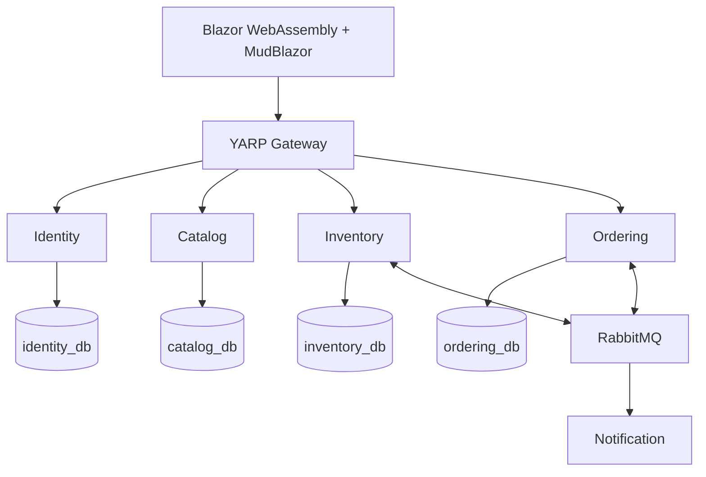

# MicroShop

A .NET 10 microservices learning project. Phase 0 defines the architecture; application implementation starts in Phase 1.
Read docs/IMPLEMENTATION_PLAN.md for the roadmap and AGENTS.md for repository working rules.

Each service owns its database. EF Core handles writes and Dapper read projections.
Learn synchronous HTTP before asynchronous reservations, then Outbox/Inbox and observability.
No business functionality is implemented in this planning checkpoint.
