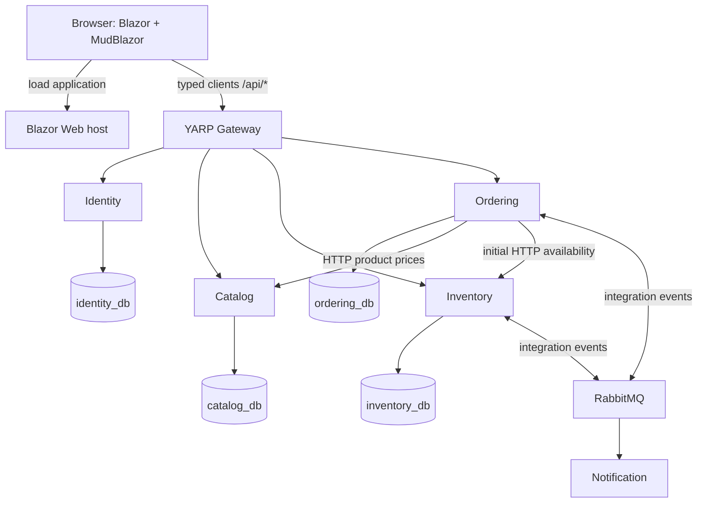
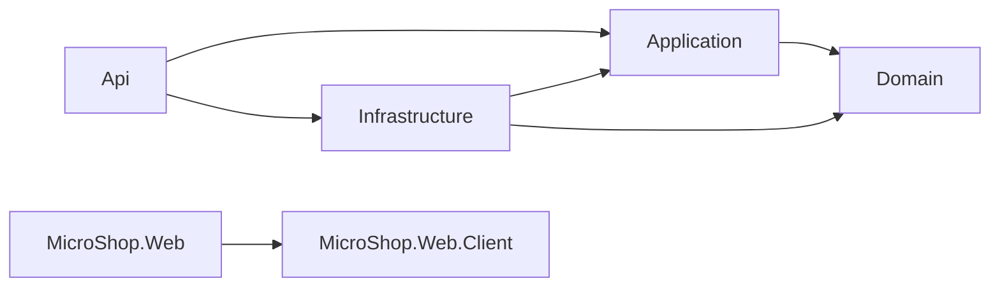
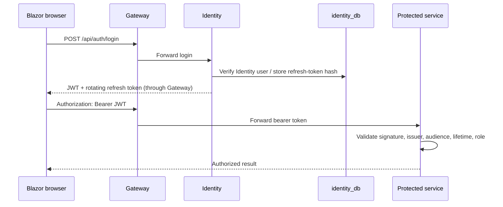
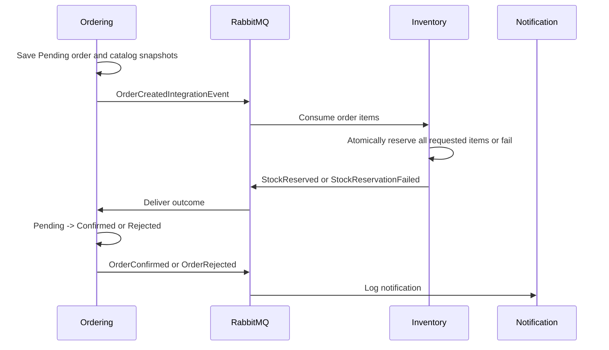

# Architecture

This file is canonical (uppercase avoids a second case-only filename on Windows).
The diagrams describe the target. See CURRENT_STATUS for what exists today.

## System

The browser executes interactive components in WebAssembly. The Web host serves the application;
it is not a business API or another gateway. YARP contains routing and cross-cutting concerns only.
Notification is initially one small ASP.NET Core host with a background consumer (added in Phase 12),
which leaves room for health endpoints without layering a log-only consumer.

## Service and data boundaries
| Owner | Database | Data |
|---|---|---|
| Identity | identity_db | Users, roles, hashed rotating refresh tokens |
| Catalog | catalog_db | Products, categories, authoritative prices |
| Inventory | inventory_db | On-hand/reserved quantities, reservations/releases |
| Ordering | ordering_db | Orders, items with snapshots, customer identifiers |
| Notification | None initially | Structured notification logs |

One PostgreSQL container may host all databases locally. Each service gets a separate role, with
PUBLIC connection privileges revoked and grants restricted to its own database. Phase 2 must verify
cross-database denial: separate names alone do not enforce isolation.
There are no cross-service database foreign keys. IDs refer to external facts; order item names/prices
are snapshots so later catalog edits do not rewrite order history.

## Compile-time dependency direction

Repeat the service graph for Identity, Catalog, Inventory and Ordering.
Domain has no external package dependencies. Application starts without external packages.
Infrastructure implements narrow persistence and HTTP interfaces owned by Application.
API is the composition root, not the use-case implementation.
No service references another service project. Tests will enforce these boundaries and detect cycles.

BuildingBlocks:
- Contracts: only versioned integration event DTOs when Phase 10 starts; no domain entities or shared REST models.
- Messaging: native RabbitMQ transport implementation and minimal abstractions, introduced in Phase 10.
- Observability: reusable logging/tracing/health registration introduced in Phase 15.
These projects start empty; no speculative interfaces are generated.
When needed, Application may reference Contracts; Infrastructure may reference Messaging and Contracts;
hosts may reference Observability. Domain remains isolated.

## HTTP and gateway
| Route (Phase 7+) | Destination | Local URL |
|---|---|---|
| /api/auth/{**catch-all} | Identity.Api | http://localhost:5210 |
| /api/catalog/{**catch-all} | Catalog.Api | http://localhost:5220 |
| /api/inventory/{**catch-all} | Inventory.Api | http://localhost:5230 |
| /api/orders/{**catch-all} | Ordering.Api | http://localhost:5240 |

Service endpoints use the same prefixes; YARP need not strip paths.
Gateway listens at http://localhost:5200; Web at http://localhost:5100; Notification at http://localhost:5250.
Typed frontend API clients know Gateway only. Ordering uses IHttpClientFactory-backed typed
ICatalogServiceClient and IInventoryServiceClient over internal service URLs.
Propagate cancellation, bound timeouts, handle non-success responses and use ProblemDetails.
Do not retry order creation blindly; write retries require an idempotency strategy.
Use a narrow Web-origin CORS policy on Gateway when browser HTTP calls arrive in Phase 8.
Local Phase 1 HTTP is intentional and carries no credentials. Phase 9 adds documented HTTPS configuration
for credential/token traffic; later container examples must clearly label any localhost HTTP-only mode.

## Blazor
MicroShop.Web hosts SSR/static delivery and WebAssembly assets; MicroShop.Web.Client holds
interactive pages, components, layout, typed clients, UI models, authentication, state and UI services.
Use WebAssembly interactivity explicitly, avoiding Auto/Server mode confusion.
Initially disable prerendering on interactive routes to avoid duplicate execution and two registrations
of browser-only state. This trades first-render speed for a simpler learning model.
MudBlazor layout and business pages start in Phase 8. Components contain presentation, not raw HTTP.
Client models are UI/API shapes, never service Domain references.

## Authentication (Phase 9)

Public registration can only create Customer accounts. Admin assignment is controlled seeding/admin behavior.
Roles are enforced server-side. Derive CustomerId from verified claims, never trust a caller-supplied owner.
Initial JWT/refresh tokens stay in browser memory; reload requires login.
Use an asymmetric development signing key so APIs receive public verification material only.
Keep the private key outside source and containers' public assets. Rotate/revoke hashed refresh tokens;
reject reuse atomically and revoke the token family. Persistent sessions/cookie-BFF architecture are deferred.

## Orders
Synchronous lesson (Phase 6): browser -> Gateway -> Ordering -> Catalog price lookup ->
Inventory availability -> Ordering EF transaction. Store validated item snapshots in ordering_db.
An availability check does not reserve stock. Pending orders remain unconfirmed in this lesson,
with the UI explaining the learning-stage behavior. Do not claim stock-safe checkout.

Async lesson (Phase 11):

Use server-side prices and a single documented currency initially. Reject non-positive quantities,
aggregate repeated product IDs and bound order sizes. Reserve multi-item stock in one transaction,
with deterministic locking/conditional writes and concurrency tests. Never partially reserve a rejected order.
Cancelled orders require an explicit cancellation request/event and an idempotent release command.
A late reservation success for a cancelled order must trigger release, not reconfirm it.
Reservation records keyed by OrderId protect stock effects; Inbox later adds general EventId deduplication.
No automatic expiry is needed initially; adding it requires a documented policy.

## Messaging and reliability
Use a durable topic exchange (planned: microshop.events), stable event-type routing keys and separate
durable consumer queues for Inventory, Ordering and Notification. Each subscriber needs its own queue.
Events contain EventId, occurrence timestamp, version, correlation context and business IDs/items.
No domain entities or credentials in messages.
Native RabbitMQ.Client teaches connection/channel lifecycle, persistent publishing, confirms,
mandatory routing/unroutable handling, prefetch, manual ACK after commit, bounded retries and dead-letter handling.
Avoid infinite immediate requeue loops. Inventory's stock reservation must be safe under repeat OrderId delivery
even before the general Inbox lesson.

Phase 10/11 intentionally expose the DB commit / publish gap. Phase 13 saves entity changes plus Outbox row
in the same local transaction; a worker publishes and marks processed only after broker confirmation.
Ordering and Inventory both need Outbox for a recoverable multi-hop workflow.
A crash after publish but before marking processed still duplicates delivery: this is at-least-once, not exactly-once.
Phase 14 records processed EventId in the same transaction as the consumer state update and outgoing Outbox event.
Notification initially provides best-effort logs; persistent exactly-once notification delivery is not claimed.

## EF Core and Dapper
One DbContext/migration history per database. EF tracks commands and transactions; Dapper uses parameterized,
paginated read projections from that service's database. No generic repository that duplicates DbSet.
Identity uses its framework stores for authentication-related reads/writes.
Do not share a DbContext across concurrent tasks. Apply migrations explicitly in development;
later Compose initialization must be single-owner and documented.

## Docker and observability
Phase 2: PostgreSQL (5432), RabbitMQ (5672, management 15672); persistent named volumes and health checks.
Implemented Phase 2: postgres:17.11-bookworm and rabbitmq:4.2.9-management on the default Compose network.
Only localhost ports are published. The current machine uses PostgreSQL host 5433 via ignored .env
because native PostgreSQL occupies 5432; the container and repository default remain 5432.
Service owner roles are identity_app/catalog_app/inventory_app/ordering_app. PUBLIC database/schema
access is revoked and only the matching owner is granted access; the bootstrap microshop_admin is
separate from application credentials. All 12 cross-service connection attempts are verified denied.
Volumes are microshop_postgres_data and microshop_rabbitmq_data; RabbitMQ keeps a stable hostname.
Bootstrap scripts create no application tables. See [Docker runbook](docker.md) for actual lifecycle tests.
ConnectionStrings__Database is the per-service setting, prepared by Set-ServiceEnvironment.ps1.
Catalog now consumes and validates it; other service skeletons do not consume database settings yet.
Phase 3 adds Product/Category, CatalogService, command-specific ICatalogWriter/EfCatalogWriter,
ICatalogReader/DapperCatalogReader and CatalogDbContext. Domain/Application remain package-free.
Only catalog_db has application tables; category/product foreign keys stay inside Catalog.
Migrations and Development seeding run explicitly, not during HTTP startup. Tests use real PostgreSQL
with isolated disposable schemas. See [Catalog guide](catalog.md), [database ownership](database-ownership.md)
and [EF/Dapper data flow](efcore-vs-dapper.md); ADR-015 records validation/concurrency decisions.
Phase 16: add seven application hosts (four APIs, Notification, Gateway, Web); internal HTTP port 8080,
service DNS and environment configuration. Client is a build artifact hosted by Web, not another container.
Use internal service URLs inside containers and host-accessible URLs in browser configuration.
No production secrets in source. .env.example lists placeholders; local .env is ignored.
Health checks distinguish process liveness and dependency readiness. Broker failure should not prevent
Ordering accepting Outbox-backed orders once that feature exists.
Phase 15 adds structured logs, traces, metrics and OTLP configuration in Observability.
Choose the smallest suitable local OTLP viewer at Phase 15 and document that addition; no viewer stack now.
HTTP trace propagation is automatic where instrumented; message headers need explicit context propagation.
A browser-to-gateway parent span needs explicit browser-side work; do not claim it solely from backend tracing.

## FUTURE / TARGET CLOUD ARCHITECTURE — NOT STARTED

This is learning-roadmap context only. The current local architecture, projects and deployment files are unchanged.
Phases 0–18 must be learned first; no Aspire or Azure implementation is present.

| Future phase | Planned extension/comparison | Boundary to preserve |
|---|---|---|
| 19: Aspire | AppHost, Service Defaults, discovery, configuration, Dashboard and telemetry | Explicit Compose/Docker concepts remain understandable |
| 20: Azure foundation | Resource model, access, environments, naming/tagging and cost | Understand the platform before application migration |
| 21: ACR / Container Apps | Registry/image lifecycle and existing container deployment | Reuse existing services; no Azure-specific redesign |
| 22: Azure PostgreSQL | Flexible Server, connectivity/migrations/backups | identity_db, catalog_db, inventory_db, ordering_db retain separate ownership |
| 23: Service Bus | Alternative IEventBus provider alongside RabbitMQ | Preserve events and Outbox/Inbox reasoning; document broker-semantic differences |
| 24: Key Vault / Managed Identity | Appropriate secret/identity access and RBAC | Distinguish local credentials from cloud identities; no committed secrets |
| 25: Azure observability | Monitor, Application Insights, Log Analytics and KQL | Reuse OpenTelemetry; compare with local Aspire Dashboard |
| 26: Bicep / azd | Repeatable parameterized infrastructure | Portal exploration cannot be the final provisioning dependency |
| 27: CI/CD | One primary GitHub Actions or Azure DevOps path | Build/test/image/deploy/verify with environment separation and rollback |
| 28: Advanced Azure | API Management, Entra ID, App Configuration/flags, private networking, scaling/security | Retain YARP initially and compare responsibilities before changes |

Conceptual future messaging options are IEventBus -> RabbitMqEventBus or AzureServiceBusEventBus;
none of those implementations is introduced by this roadmap change.
Kubernetes/AKS is a separate later track; Dapr/service mesh are optional later topics, not core dependencies.
See IMPLEMENTATION_PLAN.md and ADR-014 for the ordered prerequisites and scope boundaries.

## Sources consulted for planning
- [Blazor render modes](https://learn.microsoft.com/en-us/aspnet/core/blazor/components/render-modes?view=aspnetcore-10.0)
- [YARP getting started](https://learn.microsoft.com/en-us/aspnet/core/fundamentals/servers/yarp/getting-started?view=aspnetcore-10.0)
- [MudBlazor installation](https://mudblazor.com/getting-started/installation)
