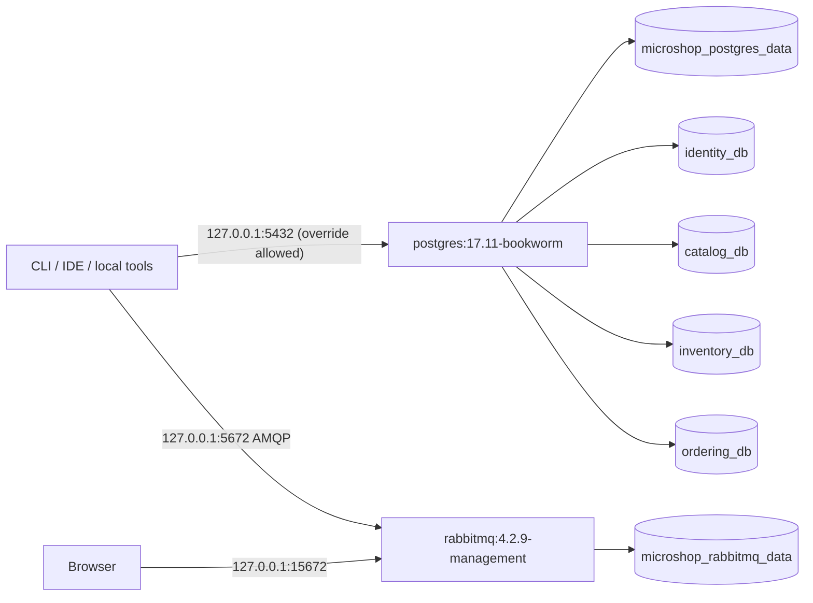

# Local development infrastructure (Phase 2)

Only PostgreSQL and RabbitMQ run in Docker. Application hosts still run from the CLI/IDE.
No EF/Npgsql/Dapper/RabbitMQ NuGet packages, application tables, migrations, message contracts,
publishers or consumers are introduced in this phase.

## Topology



Compose project name: microshop. Default network: microshop_default.
Predictable Compose-generated container names: microshop-postgres-1 and microshop-rabbitmq-1.
No container_name override is needed. RabbitMQ uses stable hostname microshop-rabbitmq so its persisted
node identity survives container recreation. Both services use restart: unless-stopped.
Only localhost ports are published; internal database port remains 5432 even if the host port changes.

On the implementation machine, native PostgreSQL already occupies 5432.
The ignored .env uses POSTGRES_PORT=5433. The public example/default stays 5432.
No existing PostgreSQL service or other project's volumes were changed.

## First start

Prerequisites: Docker with a running Linux engine and Compose v2. Phase 2 PowerShell helpers require PowerShell 7.3+.
Run commands from the repository root.

```powershell
docker version
docker compose version
./scripts/New-DevelopmentEnvironment.ps1
# If 5432 is occupied, use this INSTEAD when creating .env:
# ./scripts/New-DevelopmentEnvironment.ps1 -PostgresPort 5433
docker compose config --quiet
docker compose up -d
docker compose ps
```

The generator refuses to overwrite .env. It reads .env.example and generates six distinct random
development passwords, without printing values. Alternatively copy .env.example to .env and replace the
public development examples yourself. Keep .env locally; Git ignores it.
Use `docker compose up -d --wait --wait-timeout 120` when a command should wait for health.
Initial image downloads may take longer than container startup.

`docker compose config` renders the configuration but also exposes resolved passwords.
Use `docker compose config --quiet` for validation and avoid pasting the full resolved configuration into logs/chat.
The helpers capture resolved JSON in memory without printing it, so Compose quoting and variable precedence
are honored. Process environment variables override .env values.

## Configuration

| Variable in .env | Purpose / example |
|---|---|
| POSTGRES_PORT | Host TCP port; 5432 by default, 5433 on initial machine |
| POSTGRES_ADMIN_PASSWORD | Bootstrap administrator password; never use in a service |
| IDENTITY_DB_PASSWORD | identity_app password |
| CATALOG_DB_PASSWORD | catalog_app password |
| INVENTORY_DB_PASSWORD | inventory_app password |
| ORDERING_DB_PASSWORD | ordering_app password |
| RABBITMQ_PORT | AMQP host port, 5672 |
| RABBITMQ_MANAGEMENT_PORT | Management host port, 15672 |
| RABBITMQ_USER | Local administrator account, microshop_dev |
| RABBITMQ_PASSWORD | Local broker administrator password |
| RABBITMQ_VHOST | Initial vhost, microshop |

Missing/empty passwords make Compose validation fail. Public example values are development-only and
not production credentials. Container environment variables and .env are not a production secret store.
A user with Docker administration access can inspect them.

Bootstrap PostgreSQL login: microshop_admin; maintenance database: postgres.
Database names/owner roles are fixed in the version-controlled initialization script, avoiding extra knobs.

## PostgreSQL ownership and permissions

| Service | Database | Owner/login | Password variable |
|---|---|---|---|
| Identity | identity_db | identity_app | IDENTITY_DB_PASSWORD |
| Catalog | catalog_db | catalog_app | CATALOG_DB_PASSWORD |
| Inventory | inventory_db | inventory_app | INVENTORY_DB_PASSWORD |
| Ordering | ordering_db | ordering_app | ORDERING_DB_PASSWORD |

The init script creates four LOGIN roles with NOSUPERUSER, NOCREATEDB, NOCREATEROLE,
NOREPLICATION and NOBYPASSRLS, without role memberships.
Each database belongs to its service login, which can create future migration-owned objects.
REVOKE ALL ON DATABASE ... FROM PUBLIC removes default CONNECT and TEMPORARY access; ALL privileges
are granted only to the matching owner. PUBLIC access to postgres/template1 and each public schema
is also revoked. The matching owner receives schema access.

These are independent databases, not schemas in a shared application database. A service role cannot
connect to another service database. The bootstrap superuser can administer all databases by design;
the ownership boundary does not constrain Docker/root/superuser administrators.
Owners can deliberately alter their own grants; preserve these policies during later migrations.
No cross-database foreign keys/dependencies or application tables are created.

PostgreSQL host connections use SCRAM-SHA-256 passwords. Verification explicitly uses TCP
(-h 127.0.0.1 inside the container), including wrong-password tests; trusted bootstrap Unix-socket
access is not evidence of service authentication.

## Initialization and lifecycle

The official PostgreSQL entrypoint reads infra/postgres/init/01-service-databases.sh only when its
data directory is empty. The script reads passwords with psql's getenv and uses quoted SQL literals.
It creates infrastructure roles/databases/permissions only. LF shell line endings are enforced by .gitattributes.
EF migrations own future application tables, and each service will have separate migrations.

Initialization fails on SQL errors. It is deliberately a fresh-volume bootstrap, not a migration or
credential-rotation script. Do not manually rerun it against an existing initialized cluster.
Changing .env passwords does not update existing PostgreSQL users or RabbitMQ's persisted users.
Either explicitly rotate credentials using the service's administration tools, or reset disposable
development volumes. If initial provisioning fails partway, inspect logs; restarting a nonempty volume
will not rerun the scripts. Repair it deliberately or reset only disposable MicroShop volumes.

PostgreSQL health uses pg_isready over TCP. It means the server is accepting connections,
not that every grant/password is correct; Test-Infrastructure performs that stronger verification.
RabbitMQ health uses diagnostics ping plus check_port_connectivity.
Application /health endpoints and OpenTelemetry are still Phase 15 work.

## Connection settings for future services

Compose .env configures containers, not a separately launched dotnet process.
In the same PowerShell terminal used to launch a service:

```powershell
./scripts/Set-ServiceEnvironment.ps1 -Service Catalog
dotnet run --project src/Services/Catalog/Catalog.Api --launch-profile http
# Remove the setting when finished:
Remove-Item Env:ConnectionStrings__Database
```

Repeat in separate terminals with Identity, Inventory or Ordering. The helper sets only
ConnectionStrings__Database, using the selected service's database/login/password and published host port.
It uses the framework's generic DbConnectionStringBuilder; no persistence package or connection is needed.
Future Infrastructure code will read Configuration.GetConnectionString("Database").
The Phase 1 hosts do not consume this setting yet; this is configuration preparation, not persistence.

For IDE runs configure the same environment variable in a private launch configuration, or use
.NET user secrets when the service introduces its secret configuration. Never commit passwords to
launchSettings.json/appsettings.json or expose these values to the Blazor Client.

## Routine commands

```powershell
docker compose up -d
docker compose ps
docker compose logs postgres
docker compose logs rabbitmq
./scripts/Test-Infrastructure.ps1
docker compose down
```

Management UI: [RabbitMQ Management](http://localhost:15672).
Sign in with RABBITMQ_USER/RABBITMQ_PASSWORD from local .env. Default vhost is microshop.
The user is a development administrator; service-specific RabbitMQ users can be considered in the messaging phase.

## Verification

```powershell
docker compose config --quiet
docker compose up -d --wait --wait-timeout 120
./scripts/Test-Infrastructure.ps1
# Database-only checks:
docker compose exec -T postgres bash /microshop-verify/verify-isolation.sh
dotnet restore MicroShop.sln
dotnet build MicroShop.sln --no-restore
dotnet test MicroShop.sln --no-build --no-restore
```

The infrastructure verifier checks:
- Both Docker health states.
- Four password-authenticated owner logins, actual database ownership, restricted role attributes,
  and schema CREATE/USAGE for future migrations.
- Four wrong-password rejections and all 12 cross-service CONNECT denials.
- Published PostgreSQL TCP port.
- Management HTML, authenticated RabbitMQ API and default user's vhost permissions.
- Actual AMQP 0-9-1 Connection.Start response on the published broker port.

The AMQP check ends after the greeting and does not publish/consume. Authentication is separately
checked against the broker's management API. RabbitMQ may log an incomplete/closed handshake from
this probe; that is expected and not a business messaging failure.
The intentional wrong-password and cross-database tests also produce PostgreSQL FATAL log entries.

## Persistence and clean-start evidence

Both named volumes were absent before Phase 2. The verification created only two temporary metadata
markers: a comment on catalog_db and a RabbitMQ vhost named microshop_phase02_persistence_probe.
After docker compose down and docker compose up -d --wait --wait-timeout 120, container IDs changed
and both markers survived. Authentication/isolation checks passed again. No application tables were used.

For an isolated repeat, create markers only in disposable development infrastructure:

```powershell
docker compose exec -T postgres psql -X -U microshop_admin -d postgres -v ON_ERROR_STOP=1 -c "COMMENT ON DATABASE catalog_db IS 'microshop-phase02-persistence-probe';"
docker compose exec -T rabbitmq rabbitmqctl add_vhost microshop_phase02_persistence_probe
docker compose down
docker compose up -d --wait --wait-timeout 120
docker compose exec -T postgres psql -X -U microshop_admin -d postgres -Atc "SELECT shobj_description(oid, 'pg_database') FROM pg_database WHERE datname='catalog_db'"
docker compose exec -T rabbitmq rabbitmqctl -q list_vhosts name
./scripts/Test-Infrastructure.ps1
```

Expected: the comment and temporary vhost remain. Remove test markers afterward if retaining the volume:
COMMENT ON DATABASE catalog_db IS NULL; and rabbitmqctl delete_vhost microshop_phase02_persistence_probe.
Do not overwrite a meaningful existing database comment to repeat this probe.

A clean reset was also performed after checking the exact MicroShop volume names and Compose ownership
labels. Only these newly created test volumes were removed; unrelated Docker volumes were preserved.

**Full development reset deliberately deletes both databases and broker data:**

```powershell
docker compose down -v
docker compose up -d --wait --wait-timeout 120
./scripts/Test-Infrastructure.ps1
```

The bootstrap recreates the four empty databases/owners and initial broker user/vhost.
Old test markers must be absent. Retain .env so expected local credentials remain consistent.
Use reset only when MicroShop's data is disposable. Do not use Docker system prune or remove unrelated volumes.

| Command | Containers/network | Named volumes and data |
|---|---|---|
| docker compose down | Removed | Kept |
| docker compose down -v | Removed | Removed for this Compose project |

## Sources

Phase 4 note: Catalog and Inventory own persistent application tables. After an intentional full reset,
follow [the Catalog guide](catalog.md) and [Inventory guide](inventory.md) to reapply each migration/seed.
Ordinary startup/tests do not reset volumes; integration tests use disposable schemas in each owned database.

- [Official PostgreSQL image documentation](https://github.com/docker-library/docs/blob/master/postgres/README.md):
  bootstrap environment/empty-data initialization and volume layout.
- [PostgreSQL privileges](https://www.postgresql.org/docs/17/ddl-priv.html):
  default PUBLIC CONNECT/TEMPORARY and database privileges.
- [Official RabbitMQ image documentation](https://github.com/docker-library/docs/blob/master/rabbitmq/README.md):
  management image, initial user/vhost and stable node identity.
- [RabbitMQ monitoring](https://www.rabbitmq.com/docs/monitoring): diagnostics checks.
- [Compose down](https://docs.docker.com/reference/cli/docker/compose/down/): volume removal behavior.
