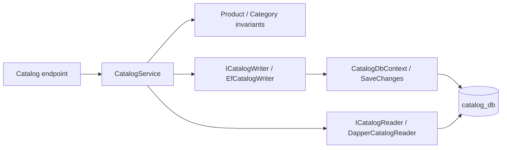

# EF Core writes and Dapper reads

Catalog demonstrates a small command/query split without a CQRS framework.

A product POST validates required fields and Domain invariants, reads the selected category through
Dapper, then saves the product through EF. Database foreign keys handle the race where that category
is removed after validation. Category uniqueness is enforced by an index, including concurrent requests.
Each write commits with SaveChanges; PostgreSQL constraint errors become application conflicts and HTTP 409.

A GET uses parameterized SQL to select DTO columns directly, joining only Catalog's own tables.
Lists execute a count plus an ordered page and return a typed PagedResult. They do not materialize
tracked EF entities or leak IQueryable to Application. Dapper receives CancellationToken through
CommandDefinition; EF receives it through async operations. One NpgsqlDataSource owns connection pooling.

Domain and Application have no persistence or web packages. ICatalogWriter is a small command-specific
boundary to keep that dependency direction; it offers atomic operations, not a generic DbSet facade.
Infrastructure uses EF Find for delete commands and existence checks inside the seed transaction;
these support writes and do not replace Dapper's API read projections.

PUT attaches a validated replacement with the supplied ID; zero updated rows become 404.
Updates use last-write-wins rather than optimistic tokens. Read-before-write validation alone cannot
guarantee uniqueness or referential integrity; database constraints provide the final enforcement.
No distributed transaction, generic repository, shared domain model or event bus is introduced.

## Inventory adjustments

InventoryService validates input and calls IInventoryWriter.AdjustAsync. EfInventoryWriter begins a
Read Committed transaction, loads a tracked InventoryItem through parameterized EF SELECT FOR UPDATE,
invokes its AdjustOnHand rule, saves and commits. The row lock serializes concurrent changes to one item.
The Domain method rejects consuming reserved stock, underflow and overflow before changing the entity.
This command-side EF read belongs to the atomic write operation. Using an earlier Dapper read followed
by an unconditional update would risk losing another request's adjustment.

IInventoryReader/DapperInventoryReader handles GET projections and paginated lists from inventory_db.
It derives Available in SQL and passes CancellationToken via CommandDefinition. No Catalog joins exist.
Inventory's command interface exposes only create and atomic adjustment operations; Application/Domain
still have no framework packages. Compare Catalog's last-write-wins descriptive edits with Inventory's
serialized stock deltas in [the Inventory guide](inventory.md) and ADR-016.

## Ordering aggregates and historical reads

OrderingService creates a Pending Order from trusted in-process priced lines. EF SaveChanges saves the
header and immutable items in one transaction: a rejected line rolls back the entire aggregate.
Items expose a read-only collection backed by a private list that EF can populate. Domain and SQL derive
totals from quantity times snapshotted price, so there is no independently editable total column.

Status commands lock the order row and refresh tracked state before applying Domain transitions. This
prevents competing outcomes or stale tracked entities from overwriting terminal state. Dapper supplies
details and customer-filtered history with local snapshot data only. It never joins live product tables.
Phase 6 adds POST checkout: Catalog/Inventory HTTP validation completes before EF persistence starts.
No database transaction spans the network reads. Failed remote checks create no order; an ambiguous commit
response still needs future idempotency rather than blind retries. See [Ordering guide](ordering.md),
[request flow](request-flow.md) and ADR-017/018 for contracts, state rules and limits.
