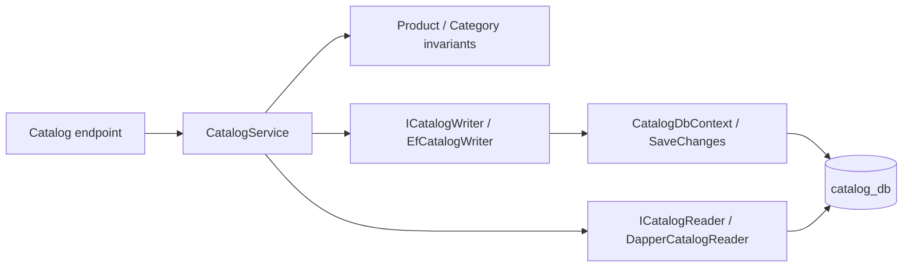

# EF Core writes and Dapper reads

Catalog demonstrates a small command/query split without a CQRS framework.

A product POST validates required fields and Domain invariants, reads the selected category through
Dapper, then saves the product through EF. Database foreign keys handle the race where that category
is removed after validation. Category uniqueness is enforced by an index, including concurrent requests.
Each write commits with SaveChanges; PostgreSQL constraint errors become application conflicts and HTTP 409.

A GET uses parameterized SQL to select DTO columns directly, joining only Catalog's own tables.
Lists execute a count plus an ordered page and return a typed PagedResult. They do not materialize
tracked EF entities or leak IQueryable to Application. Dapper receives CancellationToken through
CommandDefinition; EF receives it through async operations. One NpgsqlDataSource owns connection pooling.

Domain and Application have no persistence or web packages. ICatalogWriter is a small command-specific
boundary to keep that dependency direction; it offers atomic operations, not a generic DbSet facade.
Infrastructure uses EF Find for delete commands and existence checks inside the seed transaction;
these support writes and do not replace Dapper's API read projections.

PUT attaches a validated replacement with the supplied ID; zero updated rows become 404.
Updates use last-write-wins rather than optimistic tokens. Read-before-write validation alone cannot
guarantee uniqueness or referential integrity; database constraints provide the final enforcement.
No distributed transaction, generic repository, shared domain model or event bus is introduced.
