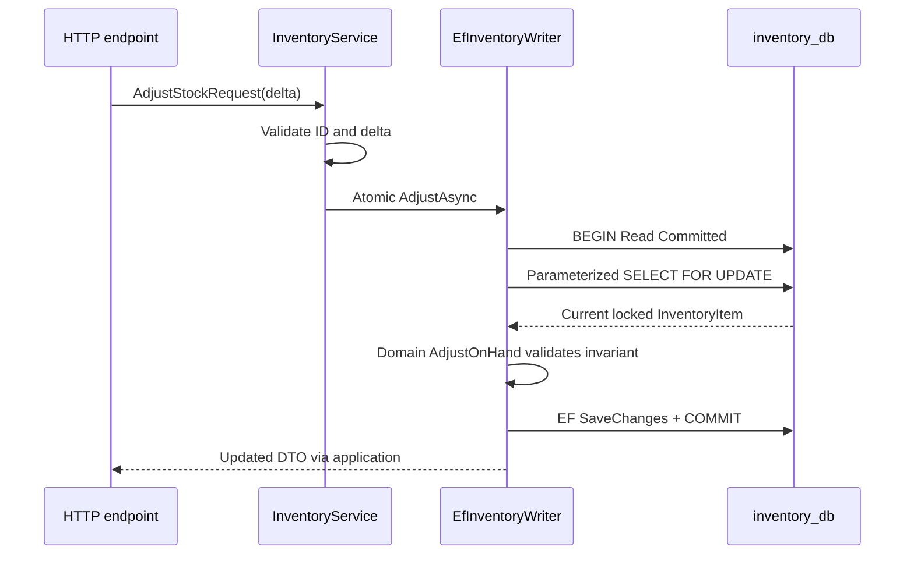

# Inventory guide

Phase 4 implements stock ownership and safe single-item adjustments. Inventory stores ProductId,
OnHand and Reserved in inventory_db; Available is always computed as OnHand minus Reserved.
ProductId is an external identifier: there is no Catalog database lookup, foreign key or project reference.
Catalog owns product descriptions/prices; Inventory owns quantities.

## Run locally

From the repository root in PowerShell 7.3+, with the existing ignored .env:

```powershell
docker compose up -d --wait --wait-timeout 120
dotnet restore MicroShop.sln
dotnet tool restore
./scripts/Set-ServiceEnvironment.ps1 -Service Inventory
dotnet ef database update --project src/Services/Inventory/Inventory.Infrastructure
dotnet build MicroShop.sln --no-restore
dotnet run --project src/Services/Inventory/Inventory.Api --no-build --launch-profile http -- --seed
dotnet run --project src/Services/Inventory/Inventory.Api --no-build --launch-profile http
```

Open http://localhost:5230/swagger or `/openapi/v1.json` (Development only). Stop the host with Ctrl+C.
The helper privately supplies ConnectionStrings__Database for this terminal. Configuration and migration
tooling require inventory_db/inventory_app; the application never uses the bootstrap administrator.
Migration and Development seed run only by explicit command, never during normal HTTP startup.

## HTTP contract

| Method | Route | Success |
|---|---|---|
| POST | `/api/inventory/items` | 201 with DTO and Location |
| GET | `/api/inventory/items/{productId}` | 200 DTO |
| GET | `/api/inventory/items?page=1&pageSize=20` | 200 paginated result |
| POST | `/api/inventory/items/{productId}/adjustments` | 200 updated DTO |

Create body: `{"productId":"22222222-2222-2222-2222-222222222221","onHand":10}`.
After seeding this ID already exists; use a new UUID to try creation, or GET/adjust the seeded item.
ProductId and OnHand are required; ID must be nonempty and quantity an integer from 0 through 2,147,483,647.
New records always start Reserved at zero. The service accepts any nonempty external ID; validating a
product against Catalog is a later communication lesson, not a hidden database dependency.

Adjustment body: `{"delta":5}` adds five; `{"delta":-3}` removes three. Delta is required and must be
a nonzero signed 32-bit integer. A deduction is permitted only while OnHand stays at least Reserved.
An addition cannot overflow the maximum quantity. Failed adjustments preserve existing quantities.

Example response: `{"productId":"22222222-2222-2222-2222-222222222221","onHand":15,"reserved":0,"available":15}`.
Available is derived in Domain and Dapper SQL, never an independently writable/stored column.
List returns `items`, `totalCount`, `page`, `pageSize`; order is ProductId, page minimum 1, pageSize 1–100.
Pages beyond the end are empty. Count and items can differ briefly during concurrent inserts.

Errors use `application/problem+json` with status/title/traceId:
400 for missing/malformed/invalid input; 404 for unknown stock item; 409 for duplicate item,
insufficient available stock or overflow. Domain validation includes field errors. Unexpected failures
return a generic 500 and are logged server-side. The API remains unauthenticated localhost learning until Phase 9.

There is no absolute-quantity PUT or delete endpoint. Changes are explicit deltas, and reservation/release
endpoints arrive with Phase 11. A successful availability GET is a point-in-time observation, not a hold.
There is no adjustment ledger or idempotency key yet. Do not automatically retry a POST after an uncertain
response: a committed adjustment may have succeeded even if the response was lost.

## Request and concurrency flow



The row lock is held until transaction completion. A writer for the same product waits, then evaluates
the newly committed state. Locks work across independent API hosts, unlike an in-process lock.
This avoids losing deltas through a read/overwrite race. Transactions are short, scoped to one request/item;
cancellation tokens reach EF and Dapper, and database commands retain Npgsql's default timeout.
Failures before commit dispose/roll back the transaction. Database check constraints also reject invalid stock.
See [PostgreSQL row locks](https://www.postgresql.org/docs/17/explicit-locking.html#LOCKING-ROWS)
and [EF parameterized SQL](https://learn.microsoft.com/en-us/ef/core/querying/sql-queries).

Domain/Application remain package-free. IInventoryWriter exposes concrete atomic operations; Infrastructure
invokes Domain rules on the locked entity. It does not introduce a generic repository. Reads use
IInventoryReader/DapperInventoryReader projections against inventory_db only. See ADR-016.

## Migration and deterministic seed

Migration `20260923090026_InitialInventory` creates inventory_items and EF history. ProductId is the
primary key. Check constraints enforce nonempty ID, nonnegative OnHand and 0 <= Reserved <= OnHand.
PostgreSQL integer bounds complement overflow-safe Domain arithmetic. There are no cross-service FKs.

| Catalog seed product (reference label only) | ProductId | Initial OnHand | Reserved |
|---|---|---|---|
| Laptop | `22222222-2222-2222-2222-222222222221` | 10 | 0 |
| Keyboard | `22222222-2222-2222-2222-222222222222` | 25 | 0 |
| Mouse | `22222222-2222-2222-2222-222222222223` | 40 | 0 |
| Monitor | `22222222-2222-2222-2222-222222222224` | 15 | 0 |
| Headphones | `22222222-2222-2222-2222-222222222225` | 20 | 0 |

Seed inserts missing IDs in one transaction and preserves all existing quantities. Run seed sequentially;
concurrent seed commands are not supported. Labels above are not stored in Inventory and no Catalog API
or database is contacted. Ordinary migrations, seeding and tests do not reset Docker volumes.

## Verification

```powershell
./scripts/Test-All.ps1
./scripts/Test-Skeleton.ps1
```

Test-All supplies separate CATALOG_TEST_CONNECTION_STRING and INVENTORY_TEST_CONNECTION_STRING privately,
runs the solution and restores previous environment settings. Test-Catalog remains a compatibility wrapper
for the same whole-solution behavior. Without the script, set both explicit test connections before dotnet test.

There are 71 tests: 4 architecture, 9 Catalog unit/application, 17 Catalog integration, 14 Inventory
unit/application and 27 Inventory integration. Real PostgreSQL fixtures create a random owned schema
with independent migration history, exclude public from SearchPath and drop only that generated schema.
The fixtures fail clearly if configuration is missing. An interrupted run can leave a disposable schema;
inspect its ownership before cleanup. Local application seed rows are not test data.

Inventory tests cover invalid input, overflow, unchanged state after failure, reads/pagination, duplicate
creation, seed preservation and raw SQL constraint rejection. Two separate test hosts perform 32 concurrent
increments; competing deductions test both zero and nonzero reserved stock. A deterministic lock test
observes the blocked database writer, commits a competing deduction and verifies the waiting request
rejects the now-insufficient quantity. Swagger/OpenAPI are also verified.

The smoke script requires both service migrations and a built solution; it starts/stops all seven hosts,
checks Catalog/Inventory database reads and Swagger HTML. It does not automate a browser.
