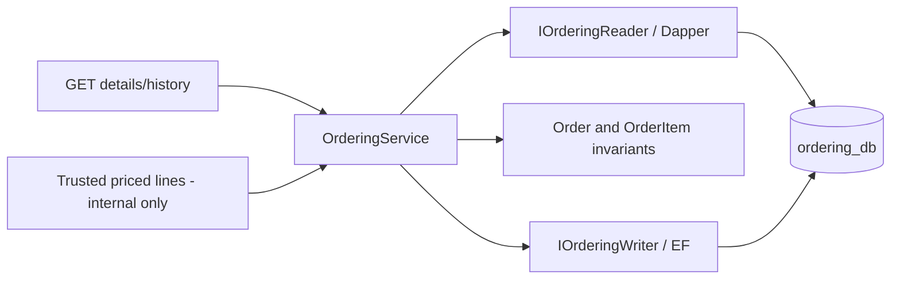

# Ordering guide

Phase 5 implements the order aggregate, local persistence and read-only HTTP history/details.
An order owns immutable product-name, unit-price and quantity snapshots. It owns customer/product IDs
as external identifiers, without querying another service database or referencing its Domain project.
Phase 6 will fetch authoritative prices/availability and expose checkout; Phase 5 has no HTTP writes.

## Run locally

From the repository root in PowerShell 7.3+, using the existing ignored .env:

```powershell
docker compose up -d --wait --wait-timeout 120
dotnet restore MicroShop.sln --disable-parallel
dotnet tool restore
./scripts/Set-ServiceEnvironment.ps1 -Service Ordering
dotnet ef database update --project src/Services/Ordering/Ordering.Infrastructure
dotnet build MicroShop.sln --no-restore --disable-build-servers -m:1
dotnet run --project src/Services/Ordering/Ordering.Api --no-build --launch-profile http -- --seed
dotnet run --project src/Services/Ordering/Ordering.Api --no-build --launch-profile http
```

Open http://localhost:5240/swagger; Development also serves `/openapi/v1.json`. Stop with Ctrl+C.
The helper privately sets ConnectionStrings__Database in this terminal; runtime/design-time validation
requires ordering_db/ordering_app. HTTP startup does not migrate or seed; --seed is Development-only.
Low build parallelism is intentional: unrestricted solution testing exhausted local memory during Phase 5.

## HTTP contract and phase boundary

| Method | Route | Result |
|---|---|---|
| GET | `/api/orders/{id}` | Order details and immutable item snapshots |
| GET | `/api/orders?customerId={id}&page=1&pageSize=20` | Paginated customer order history |

History requires a nonempty customerId UUID. Page starts at 1; pageSize defaults to 20 and is limited
to 1–100. Results contain items/totalCount/page/pageSize, ordered by CreatedAtUtc descending then ID descending.
Unknown customers and pages beyond the end return empty lists. Details for unknown orders return 404.
Malformed/empty IDs or invalid pagination return 400 ProblemDetails with traceId; business validation adds
field errors. Unknown failures return generic 500 responses with server-side logging.

Details include id, customerId, createdAtUtc, status, statusReason, total, currency and items.
Each item has productId, productName, unitPrice, quantity and lineTotal. Dates use UTC; currency is USD.
History contains the same summary fields without the item collection. Totals are calculated from snapshots.
Count/page statements are not a frozen transaction snapshot during concurrent order creation.

POST `/api/orders` and PUT on a detail route return 405. There are no create, cancel, confirm, reject or
arbitrary status-write endpoints. OpenAPI describes GET operations only. This prevents submitted client
prices from reaching the internal priced-snapshot creation use case before Phase 6 validation exists.

These reads are unauthenticated localhost learning. CustomerId filtering is not authorization;
Phase 9 must derive customer identity from verified claims and enforce detail/history ownership/admin access.

## Domain invariants and state transitions

- An order has nonempty order/customer UUIDs, a non-default UTC creation timestamp and 1–100 input lines.
- An item needs a nonempty product ID, trimmed name of 1–120 characters, decimal unit price from
  0 through 99,999,999.99 with at most two decimal places, and integer quantity from 1 through 1000.
- Duplicate product IDs merge quantities only if name and price snapshots match; merged quantity still
  cannot exceed 1000. Conflicting snapshots are rejected rather than silently choosing one.
- The constructor copies items into a read-only collection. Existing orders have no item editing API.
- LineTotal = UnitPrice × Quantity; Total = sum of LineTotal. Neither total is independently stored/editable.
  Maximum supported total is 9,999,999,999,000.00 USD; decimal arithmetic preserves cents without floating point.

| Current | Allowed next status |
|---|---|
| Pending | Confirmed, Rejected, Cancelled |
| Confirmed | Cancelled |
| Rejected | Terminal |
| Cancelled | Terminal |

Repeating the current non-Pending status is a no-op, preserving its original reason. Returning to Pending
or an undefined status is invalid. Rejection requires a nonblank reason, trimmed and at most 500 characters;
cancellation can carry an optional reason. Confirmation accepts no reason. Invalid changes preserve state.
A cancelled order cannot be reconfirmed by a late outcome.

These are local state rules, not inventory actions: confirmation currently does not reserve stock and
cancellation does not release it. Tests exercise the transitions directly; no public transition API exists.
The later reservation workflow must coordinate changes with Inventory and handle late success/release.
Same-status no-ops do not constitute full event deduplication, Outbox/Inbox or creation idempotency.

## Layers and request/data flow



OrderingService.CreateFromPricedLinesAsync creates a Pending aggregate with a generated ID and TimeProvider
UTC timestamp, then persists header and all lines through one EF SaveChanges transaction. The input
PricedOrderLine is a trusted in-process contract, not proof that prices were validated. Never bind it to HTTP.
The development seed uses fixed example snapshots; it does not fetch current Catalog prices or contact Inventory.

Status commands start a short Read Committed transaction and lock the order row with SELECT FOR UPDATE.
They refresh even an already tracked order before Domain validation, then save/commit. Concurrent incompatible
outcomes have one winner; the next command evaluates the current committed status. EF transaction disposal
rolls back failures. API reads use parameterized Dapper SQL and join/project only Ordering-owned data.
Cancellation reaches EF and Dapper. Domain/Application have no web, ORM or broker packages.

The Order.Items collection has an EF-accessed backing field while callers receive a read-only view.
See [EF relationship navigation guidance](https://learn.microsoft.com/en-us/ef/core/modeling/relationships/navigations).
The only foreign key is order_items.order_id -> orders.id, inside this aggregate/database.

## Phase 6 client contracts

ICatalogServiceClient.GetProductAsync returns ProductId, Name, UnitPrice and Currency or null.
IInventoryServiceClient.GetAvailabilityAsync returns ProductId and Available or null.
These narrow Ordering.Application interfaces are explicitly planned for the next phase. There are no
registered implementations, fake production responses or HTTP requests yet. Phase 6 must validate USD,
missing products/stock, aggregate cart quantities and obtain server prices before invoking creation.
Availability checking then creates Pending orders only; it is not a stock reservation.

## Database and deterministic examples

Migration `20260923111937_InitialOrdering` creates orders, order_items and EF history in ordering_db only.
Indexes support customer/date/ID history; item PK is (order_id, product_id). Checks enforce valid row IDs,
status/reason combinations, positive bounded quantities, names and nonnegative prices. Aggregate line count,
immutable snapshots and transitions are enforced by Domain/use cases, not cross-row SQL triggers.

Synthetic customer: `33333333-3333-3333-3333-333333333331` (not an authenticated Identity account).

| Example | Order ID | Status | Snapshot total |
|---|---|---|---|
| Laptop ×1, Mouse ×2 | `44444444-4444-4444-4444-444444444441` | Pending | 1059.97 USD |
| Keyboard ×1 | `44444444-4444-4444-4444-444444444442` | Cancelled | 79.99 USD |

The two orders have three item rows. Sequential seed reruns insert missing orders and preserve existing
statuses/items. Catalog and Inventory are neither queried nor modified. No Docker volumes are reset.

## Verify

```powershell
./scripts/Test-All.ps1
./scripts/Test-Skeleton.ps1
```

Test-All privately sets separate CATALOG_TEST_CONNECTION_STRING, INVENTORY_TEST_CONNECTION_STRING and
ORDERING_TEST_CONNECTION_STRING, runs the suite with bounded build concurrency and restores old values.
Missing test configuration fails explicitly. Each real PostgreSQL fixture creates/migrates/seeds its own
random schema, excludes public from SearchPath and drops the schema at teardown. An interrupted process
can leave a disposable test schema; inspect ownership before cleanup.

Ordering tests cover exact/max totals, snapshot copying, duplicate aggregation, quantity/price limits,
state transitions/no-op outcomes, aggregate rollback on an invalid item, customer history isolation,
concurrent incompatible outcomes, refreshing stale tracked state and seed preservation. HTTP tests
verify ProblemDetails, absence of write routes and GET-only OpenAPI/Swagger. The previous suites also run.
Smoke checks start/stop seven actual HTTP hosts and verify Ordering reads and rejected POST, without browser automation.
